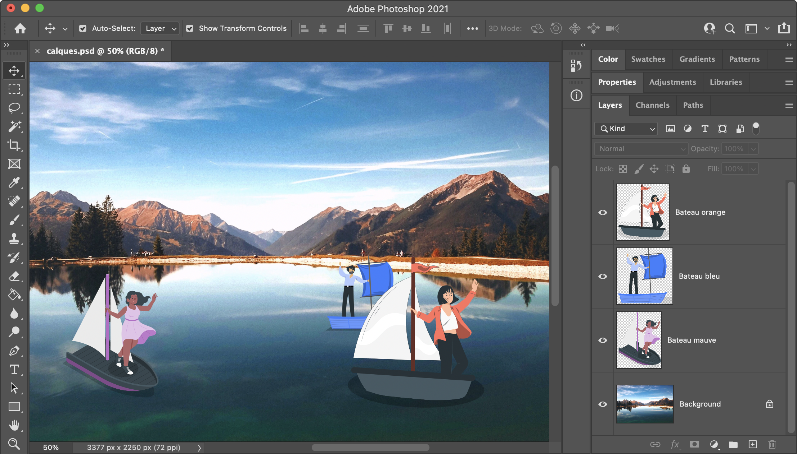
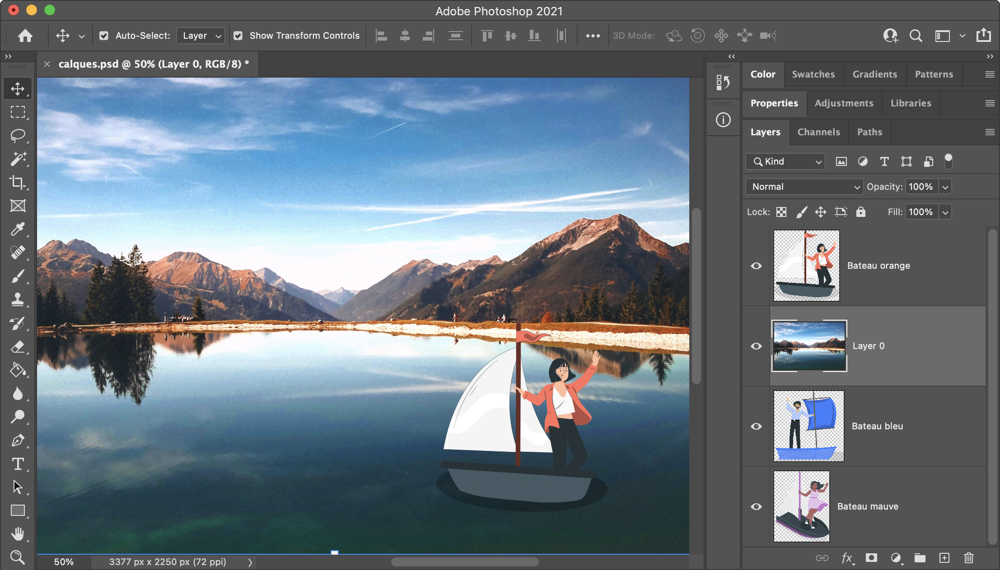
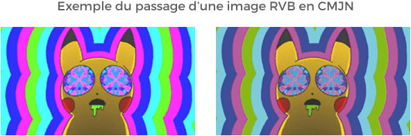

<!-- omit in toc -->
# Les Fondamentaux

Dans les prochaines sessions de cours nous allons utiliser des logiciels tels que **Photoshop** et **Illustrator**. Voyons quelques principes fondamentaux à la bonne compréhension des cours qui vont suivre.

<!-- omit in toc -->
## Table des matières

- [Le système de calques](#le-système-de-calques)
- [CMJN / RVB](#cmjn--rvb)
  - [Le RVB c’est quoi ?](#le-rvb-cest-quoi-)
  - [Le CMJN c’est quoi ?](#le-cmjn-cest-quoi-)
- [Hexadécimal / RGB(A) / CMJN](#hexadécimal--rgba--cmjn)
  - [HEX](#hex)
  - [RGB(A)](#rgba)
  - [CMJN](#cmjn)
  - [TSL](#tsl)

## Le système de calques

Si je vous parle de couche cela devrait vous aider à mieux comprendre les calques, après tout le terme en anglais est "layer".


> Animation d'un plan 3D pour appréhender le concept de calques

Il faut imaginer qu'un calque c'est une feuille transparente, sur cette feuille on peut "dessiner" ce que l'ont veut. Ensuite on peut superposer une autre feuille transparente avec un autre dessin, et ainsi de suite. Lorsqu'on ajoute toutes ces feuilles l'une sur l'autre cela forme une image. L'ordre est super important, en fonction de qui est au plus haut dans la liste et qui est au plus bas, certains détails apparaîtront ou non.



> Exemple d'un document `.psd` avec quelques calques. Regardez bien l'ordre des calques, le bâteau orange est par dessus le bâteau bleu, du coup ce dernier n'est pas entièrement affiché.

Dans l'exemple suivant, j'ai juste remonté le calque de la photo de fond entre les différents personnages. Du coup, comme le bateau avec le personnage orange est toujours au dessus, celui-ci apparaît, les autres sont cachés en-dessous du fond.



> Exemple de réaction suite à un changement d'ordre de calques

Pour encore mieux comprendre le principe, voici un autre exemple où j'ai caché la photo. Vous pouvez voir du coup un fond en damier composé de carré blanc et gris. C'est un fond que Photoshop utilise pour nous signaler que cette partie là est transparente.


> Regardez ces magnifiques carrés blanc et gris! C'est le fond transparent de votre image.

Vous pouvez retrouver le ```.psd``` utilisé en exemple en [le téléchargeant ici :floppy_disk:](https://drive.google.com/file/d/1W3rlU91HKrIuuZS1AdalwqmL_MZOQSt7/view?usp=sharing)

Voici également un lien vers un tuto [Adobe Photoshop](https://helpx.adobe.com/be_fr/photoshop/how-to/ps-layers-basics.html) qui explique plus en profondeurs l'utilisations des calques. Pas de panique, nous verrons cela ensemble.

[:arrow_up: Revenir au top](#table-des-matières)

## CMJN / RVB

Lors de la création de vos futurs visuels, il y a de fortes chances que vous utilisiez des couleurs… Quand vous créé un nouveau document dans Photoshop ou Illustrator vous pouvez définir le `mode colorimétrique` sur `RVB` ou `CMJN`. 

Les couleurs qui s’affichent sur votre écran, ne seront jamais les mêmes que celles qui seront imprimées...

### Le RVB c’est quoi ?

Le mode de couleurs RVB est un mode adapté au Web fondé sur trois couleurs principales, le rouge (R), le vert (V) et le bleu (B). On peut aussi le retrouver sous sa forme anglaise appelée RGB avec les initiales de Red, Green et Blue.

Attention car TOUTES les images web que vous enregistrez sont en RVB, il faudra donc les convertir en CMJN pour les imprimer.

Le RVB est un mode de travail par addition, ces trois couleurs ensemble forment la lumière blanche. Les paramètres pour chacune de ses 3 couleurs ont des valeurs comprises entre 0 et 255. Additionnées, elles vous permettent d’obtenir une nouvelle couleur. Quelques exemples :

- Blanc = R 255 + V 255 + B 255, code hexadécimal : #ffffff
- Noir = R 0 + V 0 + B 0, code hexadécimal : #000000
- Jaune = R 255 + V 255 + B 0, code hexadécimal : #ffff00
- Magenta = R 255 + V 0 + B 255, code hexadécimal : #ff00ff
- Cyan = R 0 + V 255 + B 255, code hexadécimal : #00ffff

Vous aurez ainsi un total de 256 x 256 x 256 = 16 777 216 combinaisons de couleurs possible. Le RVB a des couleurs très vives, qui accroche d’avantage l’œil sur un écran. Il est possible de faire imprimer un document en RVB a un imprimeur, mais attention, tous ne le font pas. La plupart du temps vos couleurs seront converties en CMJN, et celle-ci apparaîtront fades à coup sûr.

### Le CMJN c’est quoi ?

A son contraire, le mode CMJN est prévu pour l’impression. Cet autre mode colorimétrique est nommé aussi quadrichromie (quatre couleurs). Le CMJN est toujours composé de la suite des lettres initiales des couleurs de base avec le Cyan ,  le Magenta , le Jaune et le Noir .

Son acronyme équivalent en anglais est CMYK (Cyan, Magenta, Yellow, Key black). A l’opposé du RVB, il s’agit d’un mode qui travaille par soustraction.

Le CMJN est donc le mode couleurs à utiliser pour toute impression afin de garantir un résultat optimal.



[:arrow_up: Revenir au top](#table-des-matières)

## Hexadécimal / RGB(A) / CMJN

Il y a plusieurs façon d'utiliser une couleur dans les logiciels graphique ou sur le web. Voyons-en déjà quelques unes.

### HEX

Vous avez déjà vu ces codes couleurs `#FFFFFF`, `#BE1313`. Ce sont des codes de couleurs hexadecimal.

```css
p { color: #FF0000 }
```

### RGB(A)

Le RGB est une autre façon d'utiliser une couleur. Vous pouvez définir l'intensité de chacune des trois couleurs en indiquant une valeur allant de 0 à 255. Il est également possible de définir l'opacité (A)

```css
p { color: rgba(100%, 0%, 0%, 0.5) }
```

### CMJN

Pour utiliser des couleurs CMJN il suffit de renseigner une valeur de 0 à 100% pour chacune de ces couleurs. Le logiciel ferra le "mélange" lui-même.

### TSL

On retrouve également la possibilité de définir notre couleur via la Teinte, Saturation et Luminosité.


[:arrow_up: Revenir au top](#table-des-matières)

[:rewind: Retour au sommaire du cours](./README.md#table-des-matières)
