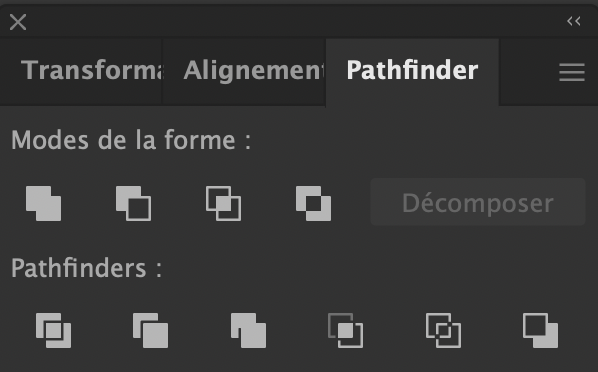

<!-- omit in toc -->
# Adobe Illustrator

Comme on l'a vu plus tôt, Illustrator est un outil permettant de créer des illustrations **vectorielle**. Il est principalement utilisé pour réaliser des éléments graphiques destinés à des affiches, pour des logos ou des illustrations de haute qualité.

Illustrator à beaucoup de points communs avec Photoshop au niveau de son interface et de ses outils. Voyons quelques outils différents.

<!-- omit in toc -->
## Table des matières

- [L'outil plume (P)](#loutil-plume-p)
- [La flèche noir vs la flèche blanche](#la-flèche-noir-vs-la-flèche-blanche)
- [Mettre un calque en modèle](#mettre-un-calque-en-modèle)
- [Tracé](#tracé)
- [Pathfinder](#pathfinder)
- [Outil Concepteur de Forme (MAJ+M)](#outil-concepteur-de-forme-majm)
- [Les outils de transformations](#les-outils-de-transformations)
- [Filet](#filet)
- [L'outil dégradé de forme](#loutil-dégradé-de-forme)
- [Le reste](#le-reste)

## L'outil plume (P)

Cet outil va devenir votre pire ennemi au début mais une fois que vous le maîtriserez il sera votre meilleur ami. Il permet de placer des points et de relier le dernier point crée au précédent et ainsi de suite. Avec lui vous pourrez créer toutes les formes que vous voulez en suivant un modèle ou non. 

Lorsque vous maintenez le clic vous pouvez également tracé une courbe. 

Il est possible d'utiliser la touche **ALT** pour "casser" votre prochaine courbe ou pour effectuer des modifications sur votre tracé.

[:arrow_up: Revenir au top](#table-des-matières)

## La flèche noir vs la flèche blanche

- La flèche noir permet généralement de sélectionner toute une forme.
- La flèche blanche permet de sélectionner les points d'un tracé pour les déplacer.

[:arrow_up: Revenir au top](#table-des-matières)

## Mettre un calque en modèle

Si vous double-cliquez sur un calque vous pouvez le passer en  **modèle**, ce qui va le verrouiller et estomper l'image. Pratique pour placer une image que l'ont souhaite vectoriser.

[:arrow_up: Revenir au top](#table-des-matières)

## Tracé

Si vous appuyez sur **CTRL+Y** vous pouvez passer toute votre création en mode tracé. Utile pour mieux visualiser où vous en êtes dans votre réalisation.

[:arrow_up: Revenir au top](#table-des-matières)

## Pathfinder

Ces outils vont vous permettre d'effectuer différentes opérations d'addition et soustraction de forme. Vous pouvez retrouver ce panneau dans le menu **Fenêtre > Pathfinder** 

[:arrow_up: Revenir au top](#table-des-matières)

## Outil Concepteur de Forme (MAJ+M)

Cet outil permet de facilement créer des formes à l'aide de formes déjà créer. Il suffit de passer l'outil sur plusieurs formes qui se superposent pour voir quelles sont les formes que l'ont peut créer.

[:arrow_up: Revenir au top](#table-des-matières)

## Les outils de transformations

Il y a beaucoup d'outils de transformations dans Illustrator comme l'outil **miroir (O)**, **rotation (R)**, **Mise à l'échelle (S)**, **déformation**,... Ces outils ont des options bien pratiques "cachées", lorsqu'un de ces outils est sélectionnés, il suffit d'appuyer sur **ENTER** pour accéder à un menu qui vous permettra de paramétrer les modifications apportées par l'outil.

[:arrow_up: Revenir au top](#table-des-matières)

## Filet

Cet outil permet de placer des points à l'intérieur de votre forme pour pouvoir y appliquer une couleur. Cela permet de faire des rendus "3D" si vous avez une bonne gestion de la couleur.

[:arrow_up: Revenir au top](#table-des-matières)

## L'outil dégradé de forme

Cet outil permet de cliquer sur une forme et ensuite sur une deuxième pour effectuer une sorte de dégradé/progression/morph entre les deux formes.

[:arrow_up: Revenir au top](#table-des-matières)

## Le reste

Il y a énormément d'outils dans Illustrator et surtout tellement de façon de les utiliser. Il est impossible de voir tout ça en si peu de temps. Il faudra donc continuer par vous même.

[:arrow_up: Revenir au top](#table-des-matières)

[:rewind: Retour au sommaire du cours](./README.md#table-des-matières)