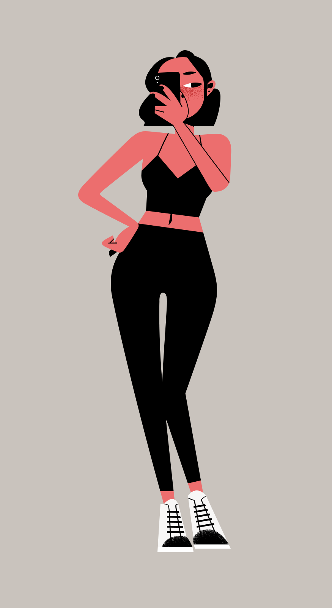
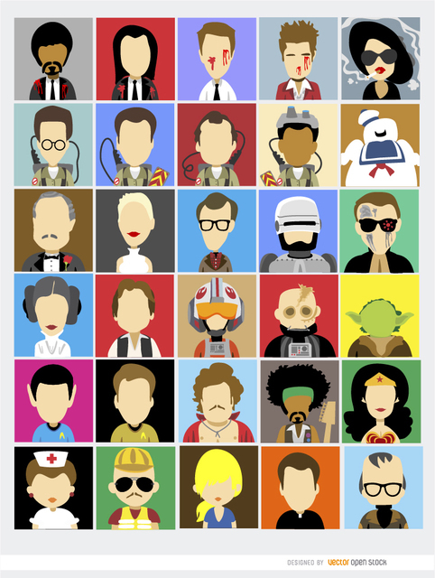
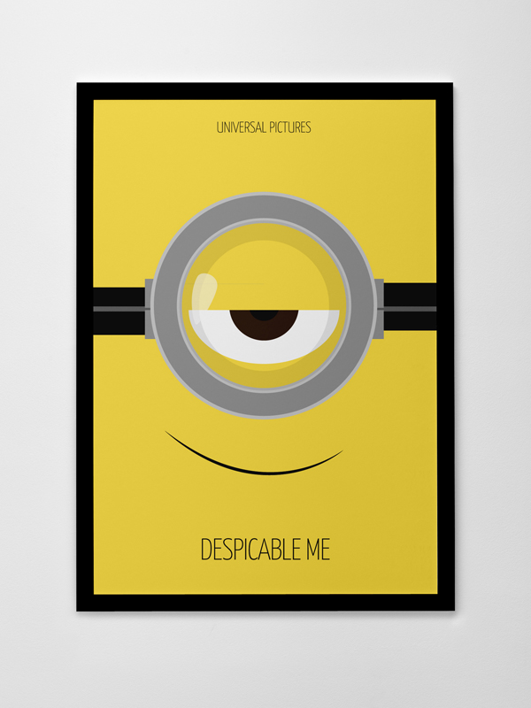

# Exercices Illustrator

## Apprendre à maîtriser l'outil Plume

Vous pouvez suivre [ce petit jeu](https://bezier.method.ac/) qui va vous aider à maîtriser l'outil plume.

## Apprendre les opérations de l'outil Pathfinder

Vous pouvez suivre [ce petit jeu](https://boolean.method.ac/) qui va vous aider à maîtriser les différentes additions et soustractions possible avec l'outil Pathfinder.

## Apprendre à reconnaître les couleurs

Vous pouvez suivre [ce petit jeu](https://color.method.ac/) qui va vous aider à faire correspondre les couleurs.

## Réalisation d'un personnage

1. Choisissez une image d'un dessin-animé/anime/manga/illustration
2. Importez-là dans Illustrator
3. Passez son calque en "modèle"
4. Reproduisez l'image le plus fidèlement possible.

Voici quelques exemples:

## Réalisation d'une affiche

1. Choisissez un film
2. Tenter de créer une affiche pour ce film en mode minimaliste
3. Pour ce faire, partez sur un format A4 en portrait
4. Ensuite choisissez d'utiliser des aplats de couleurs et très peu de dégradé.
5. Placer au centre de votre affiche un forme représentant votre film.
6. Placer d'autres éléments si nécessaires.
7. Placer les crédits (les acteurs, le réalisateur, une catch phrase,...)

Voici quelques exemples:

[:rewind: Retour au sommaire du cours](./README.md#table-des-matières)