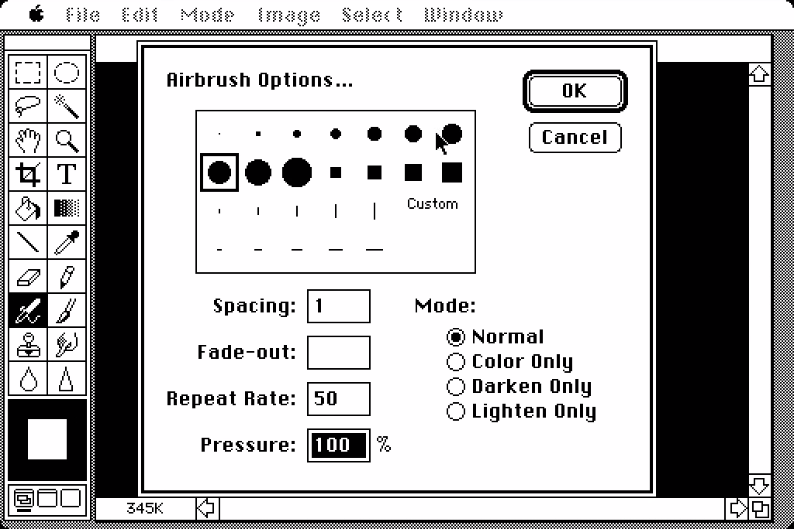
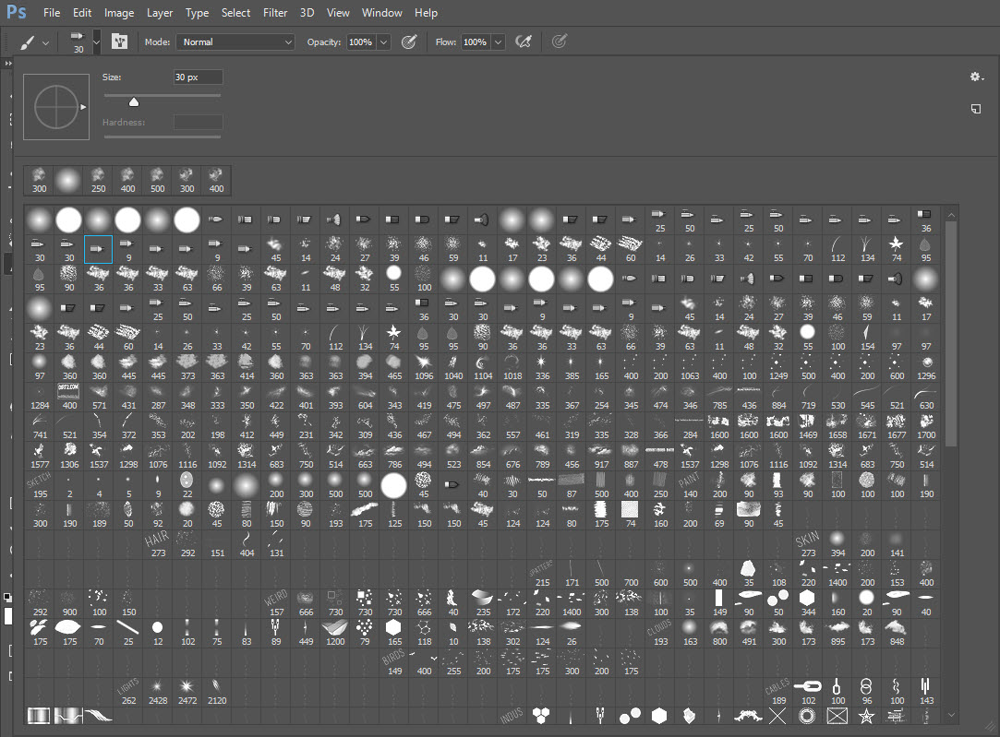
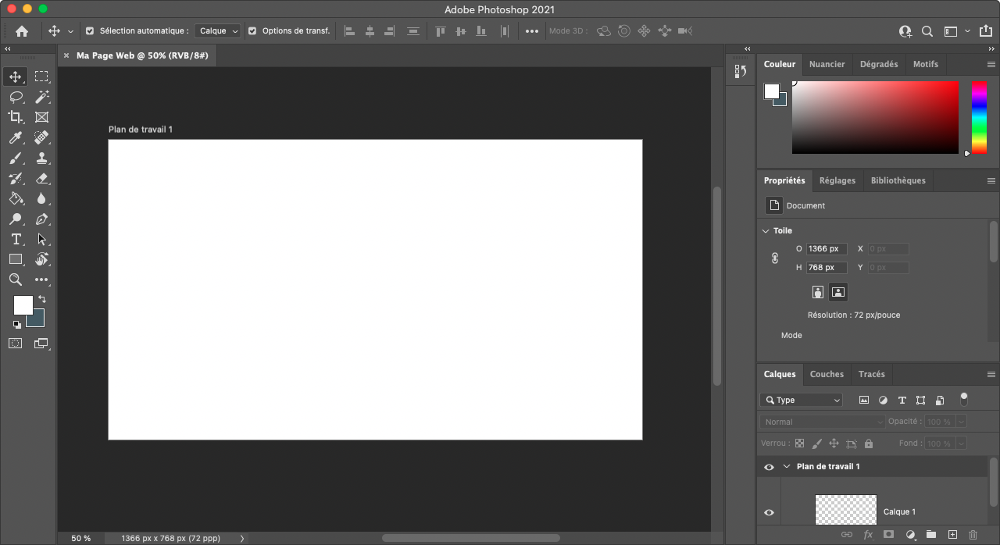
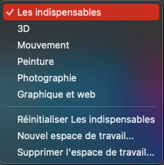
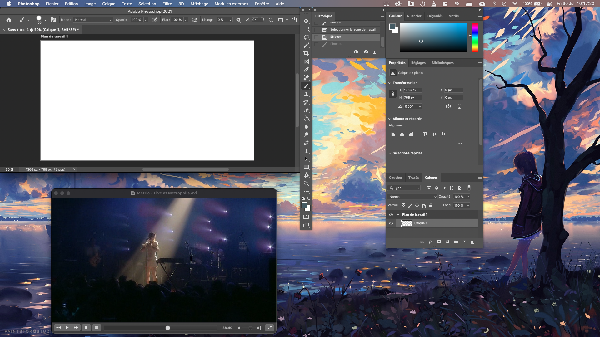
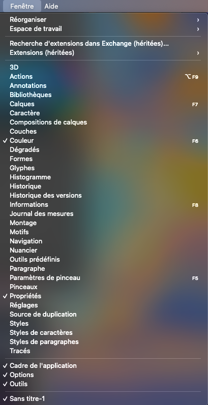
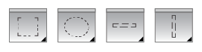
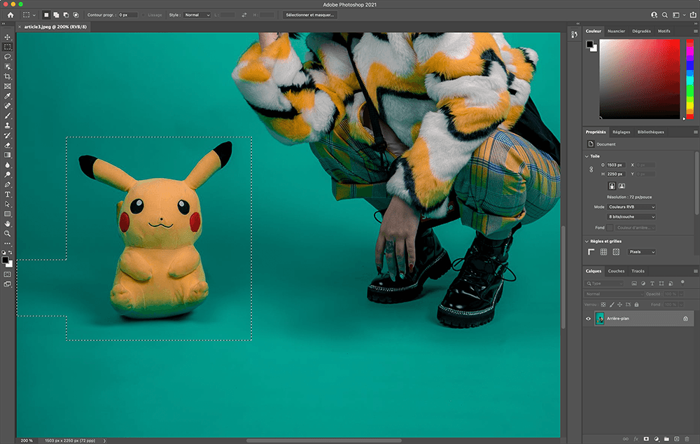
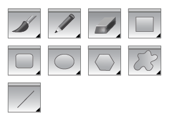
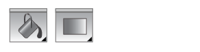

<!-- omit in toc -->
# Adobe Photoshop

Créé en 1990 par la société Adobe (prononcé "Adobi"), Photoshop est devenu le logiciel star de la retouche et création numérique. Il est principalement utilisé pour le **traitement des photographies numériques**, il sert également à la **création d’images complexes** et de **documents graphiques**. Il travaille essentiellement sur **images matricielles**, ces images sont constituées d’une grille de points appelés pixels. Photoshop possède son propre format de fichier (**extension psd**). Celui-ci permet de conserver les différents calques et effets constituant l'image afin de les manipuler séparément. 
Le programme peut également importer et exporter des fichiers d’image dans les formats les plus courants tels que gif, jpg, tiff, png, etc.

Nombres de films et séries y font maintenant référence tellement il est ancré dans la culture générale. Vous pouvez retrouver une mention de Photoshop dans [Casino Royale avec Daniel Craig.](https://youtu.be/XCt7gkcfOSE?t=83)

Le logiciel à eu nombres de versions, à l'heure de ces lignes nous sommes à la version 22.4.3. C'est énorme! Évidement il n'est pas question ici de faire un historique de toutes les versions et leurs différents apports. Sachez juste que la version 1 du logiciel était évidement très basique, et que désormais on a droit à des outils utilisant l'intelligence artificielle pour nous aider dans certaines tâches. Le bon technologique est énorme.

Si ça vous intéresse il y a pléthore de vidéo sur Youtube qui en parle, en voici quelques-unes:

- [L'histoire de Photoshop :fr:](https://www.youtube.com/watch?v=PuOkq18YcY4&ab_channel=Konbini)
- [Thomas Knoll, un des créateurs de Photoshop recrée la première démo qu'il a fait du logiciel :uk:](https://youtu.be/Tda7jCwvSzg)
- [Des artistes VFX utilisent Photoshop 1 :uk:](https://youtu.be/8LkUzVexLTU)
- [Un graphiste utilise Photoshop 1 :uk:](https://youtu.be/ftaIzyrMDqE)



> La fenêtre de l'outil pinceau en 1990



> La fenêtre de l'outil pinceau en 2021

<!-- omit in toc -->
## Table des matières

- [Créer un nouveau document](#créer-un-nouveau-document)
- [L'interface](#linterface)
  - [La gestion des interfaces](#la-gestion-des-interfaces)
- [Ouvrir / Importer une image](#ouvrir--importer-une-image)
- [Les outils principaux](#les-outils-principaux)
  - [Recadrage](#recadrage)
  - [Sélection](#sélection)
  - [Dessin Bitmap](#dessin-bitmap)
  - [La plume](#la-plume)
  - [Dégradé et remplissage](#dégradé-et-remplissage)
  - [Pipette](#pipette)
  - [Retouche](#retouche)
  - [Texte](#texte)
  - [Le reste](#le-reste)
- [Calques de réglages](#calques-de-réglages)
- [Masque](#masque)
- [Style de calque](#style-de-calque)
- [Filtres](#filtres)

## Créer un nouveau document

Lançons Photoshop et créons notre premier fichier. Pour ce faire cliquez sur le bouton ```Créer nouveau```


S'ouvre ensuite une nouvelle fenêtre qui permet de créer notre nouveau document.


Ce qui nous importe ici c'est le menu du haut avec les différents préréglages (Photo, Impression, Illustration, Web, Mobile,...). C'est là que l'on peut retrouver des formats de fichiers courants.

Sélectionnons le réglage ```"Web - Le plus courant"```. Vous pouvez remarquer que dans la partie de droite de la fenêtre les dimensions, la résolution et d'autres paramètres se sont adaptés. Donnons également un titre à notre document. Puis on peut cliquer sur ```Créer```


Et voilà on a notre nouveau document.



[:arrow_up: Revenir au top](#table-des-matières)

## L'interface

Intéressons-nous maintenant à l'interface. Elle est modulable selon vos désirs. A force de travailler dans Photoshop vous allez déplacer les différents panneaux pour mieux convenir à votre façon de travailler. Voyons comment l'interface est découpé lors du premier démarrage de Photoshop.


1. **La barre des options:** C'est ici que vous pouvez retrouvez les options principales de l'outil en cours. Cette barre change donc dynamiquement en fonction de l'outil sélectionné. Sur la partie de droite vous pouvez aussi retrouvez des options rapides de connexion mais surtout la gestion de vos interfaces. Plus d'infos là dessus dans un instant
2. **La fenêtre Document:** C'est ici que vous allez avoir la vue sur votre création.
3. **Le panneau d'outils:** Le panneau le plus important, sauf pour ceux qui connaissent tous les les raccourcis, ce sont tous les outils disponibles dans Photoshop. Nous verrons certains d'entre-eux plus loin dans ce cours.
4. **Les panneaux:** Alors ici c'est un peu particulier car au final ce sont les panneaux affichés par défaut, mais vous pouvez mettre ce que vous voulez comme panneaux. Parmi les panneaux intéressants on a par exemple celui des ```Calques```, des ```Couches```, des ```Couleurs```, des ```Réglages```, et encore tellement d'autres. Nous verrons l'utilité de certains un peu plus loin dans ce cours.

### La gestion des interfaces


Si vous cliquez sur cette icône vous devriez avoir une liste des différentes interfaces pré-définies dans Photoshop. Cela permet de changer la disposition des panneaux en fonction de l'utilité du logiciel que vous faites sur le moment. Le plus simple est de travailler avec ```Les Indispensables``` au début. Mais vous pouvez changer à tout moment. Ce qui est intéressant c'est de pouvoir ```Réinitialiser *l'interface*``` au cas où vous avez perdu vos panneaux.



Il est également possible d'enregistrer votre espace de travail, par exemple avec une configuration pour quand vous êtes sur 2 écrans. Car oui, il est possible de placez vos panneaux en dehors de l'interface.



Vous pouvez gérez tous vos panneaux dans le menu ```Fenêtre```. Vous retrouverez de nouveau les options pour gérer votre espace de travail mais aussi l'affichage ou non d'un panneau, ainsi qu'une option pour réorganiser vos fenêtres. N'hésitez pas à parcourir toutes ces options à votre rythme.



[:arrow_up: Revenir au top](#table-des-matières)

## Ouvrir / Importer une image

Pour ouvrir une image dans Photoshop plusieurs méthodes s'offrent à vous. Vous pouvez glisser-déposer la photo, utiliser le raccourcis `ctrl+o` / `cmd+o` ou bien encore passer par le menu `Fichier > Ouvrir`

[:arrow_up: Revenir au top](#table-des-matières)

## Les outils principaux

### Recadrage

 

Cet outil permet de recadrer votre image, c'est à dire, réduire ses bords pour concentrer son regard sur une partie de l'image.


### Sélection




Les outils de sélections permettent de choisir une partie de notre fichier pour travailler dedans ou pour la copier. Il est possible d'ajouter ou supprimer des zones de sélections avec les touches de modifications **SHIFT** ou **ALT**.



### Dessin Bitmap



Tous ces outils vous permettent d'ajouter des pixels de différentes façons à votre image.

### La plume


Un outil que l'on utilisera beaucoup plus dans Illustrator, la plume, permet de dessiner des courbes de bézier. Elle peut servir à faire des sélections plus complexes ou des formes différentes.

### Dégradé et remplissage



L'outil dégradé et de remplissage permettent de remplir une image ou une zone rapidement d'une couleur, un dégradé ou de contenu pris en compte (content-aware).

### Pipette


La pipette permet de sélectionner la couleur de n'importe quel pixel! Vous pouvez maintenir la touche **ALT** pour utiliser rapidement l'outil.

### Retouche


L'outil **tampon** et **correcteur** vont vous permettre d'effectuer des corrections sur vos images. Cela permet de manipuler les pixels et d'en recréer des nouveaux pour par exemples effacer un objet indésirable sur une scène ou corriger les imperfections d'un modèle.

### Texte


Cet outil vous permet de rajouter du texte à vos créations.

### Le reste

Il y a évidement encore beaucoup d'autres outils, à vous de le découvrir!

## Calques de réglages


Les calques de réglages permettent d'ajuster votre image de différentes façon sans l'altérer. Par exemple, vous pouvez modifier la teinte et saturation de votre image, manipuler sa courbe, sa luminosité,...

[:arrow_up: Revenir au top](#table-des-matières)

## Masque


Sert à masquer une partie de l'image sans devoir en supprimer les pixels. Très utilisé pour détourer un sujet.

[:arrow_up: Revenir au top](#table-des-matières)

## Style de calque


Permet d'ajouter des effets à votre calque comme par exemple des bordures, une ombre, une texture,... Il faut les utiliser avec modération, mais il y a moyen de réaliser de chouettes effets avec.

[:arrow_up: Revenir au top](#table-des-matières)

## Filtres


Toutes sortes de modifications que l'on peut apporter à notre image, comme par exemple flouter une partie de l'image, déformer ou accentuer une image,... Il faut également les utiliser avec parcimonie pour présenter un travail pro.

[:arrow_up: Revenir au top](#table-des-matières)

[:rewind: Retour au sommaire du cours](./README.md#table-des-matières)
